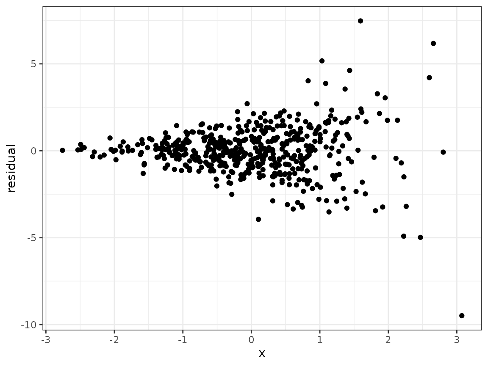
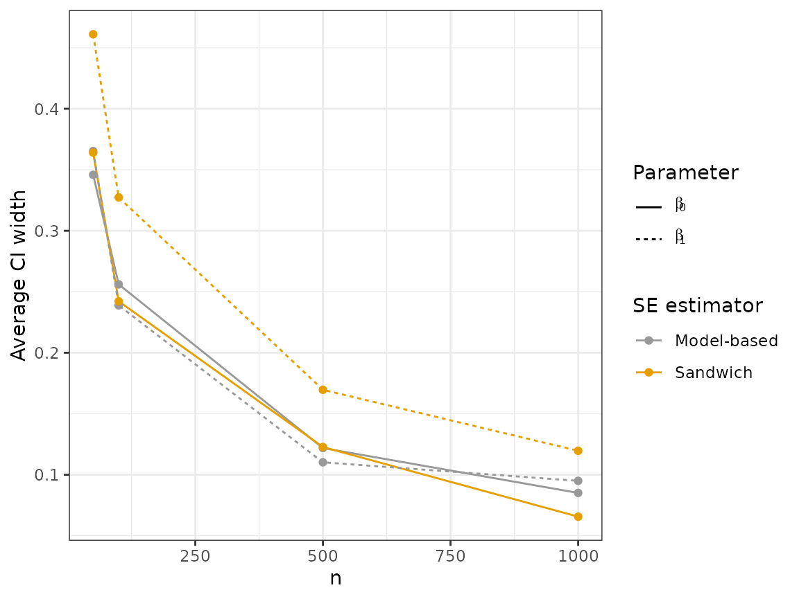
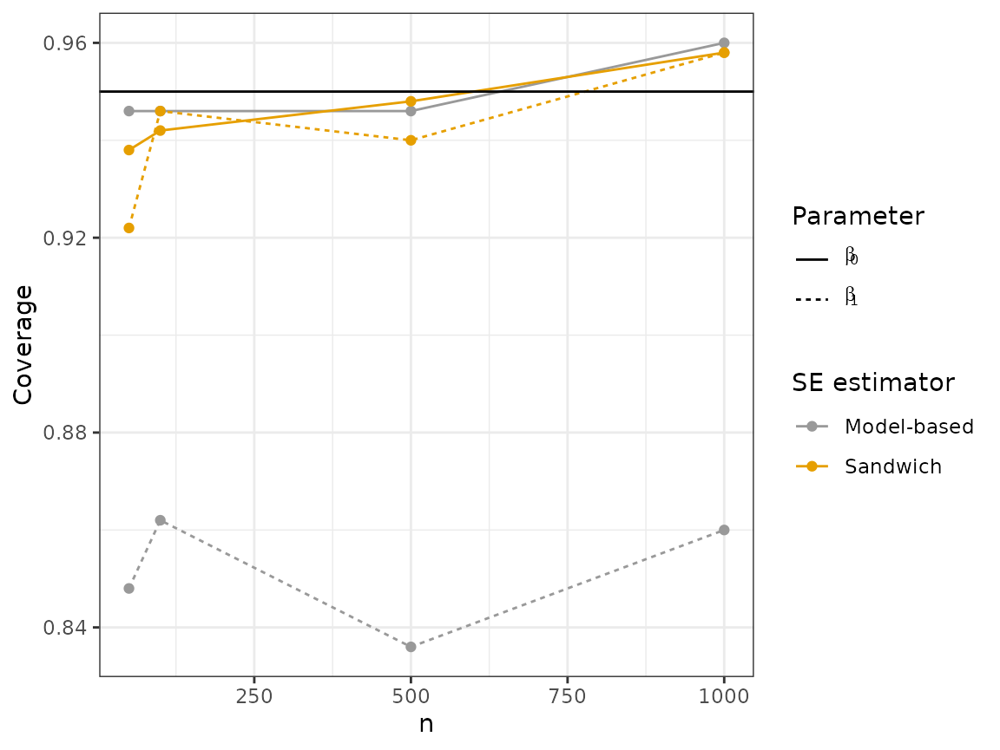
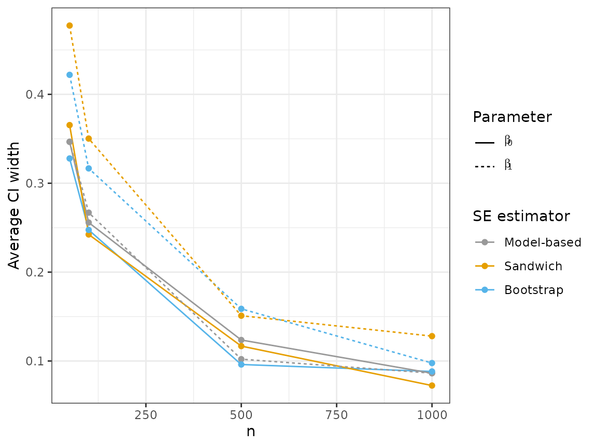
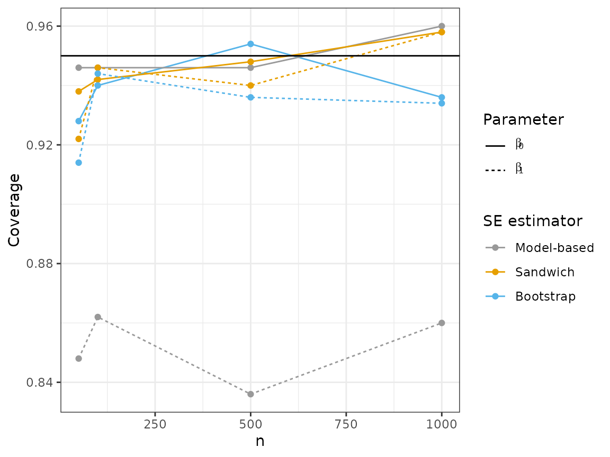

# Example 2: Comparing two standard error estimators

When developing a novel statistical method, we often wish to compare our
proposed method with one or more existing methods. This serves to
highlight the differences between our method and whatever is used in
common practice. Generally, we wish to examine realistic settings,
motivated by statistical theory, in which the novel method confers some
advantage over the alternatives.

In this example, we will consider the problem of estimating the
variance-covariance matrix of the least-squares estimator in linear
regression. We assume the reader has some familiarity with linear
regression.

Suppose our dataset consists of $n$ independent observations
$\{\left( Y_{1},X_{1} \right),\ldots,\left( Y_{n},X_{n} \right)\}$,
where $X$ and $Y$ are both scalar variables. A general linear regression
model posits that

$$Y_{i} = \beta_{0} + \beta_{1}X_{i} + \epsilon_{i}$$

where $\epsilon_{i}$ is a mean-zero noise term with variance
$\sigma_{i}^{2}$. We refer to this as a heteroskedastic model, since the
variances need not be equal across all $i$. This is the true
data-generating model. (Note: A more restrictive (but misspecified)
model assumes that there is a common variance $\sigma^{2}$ such that
$\sigma_{i}^{2} = \sigma^{2}$ for all $i$. We refer to this incorrect
model as the homoskedastic model.)

In linear regression, we use least-squares to estimate the coefficient
vector $\beta$. For the purposes of building confidence intervals and
performing hypothesis tests, we need to also estimate the standard error
of the least squares estimator. There are two common ways to do this:
(1) Use a model-based standard error that assume homoskedasticity. This
is the estimator used by default in most statistical software (including
the `lm` function in R). (2) Use a so-called sandwich standard error.
Statistical theory tells us that estimator will be consistent even under
heteroskedasticity. See the Statistical Appendix for more details.

We will carry out a small simulation study to compare these two
estimators.

We start by declaring a new simulation object and writing a function
that generates some data according to our model. For this simulation, we
will make $\sigma_{i}^{2}$ larger for larger values of $X_{i}$.

``` r
sim <- new_sim()

create_regression_data <- function(n) {
  beta <- c(-1, 10)
  x <- rnorm(n)
  sigma2 <- exp(x)
  y <- rnorm(n=n, mean=(beta[1]+beta[2]*x), sd = sqrt(sigma2))
  return(data.frame(x=x, y=y))
}
```

To get a sense of what heteroskedasticity looks like in practice, we can
generate a dataset, fit a linear regression model, and make a
scatterplot of the residuals against $X$.

``` r
dat <- create_regression_data(n=500)
linear_model <- lm(y~x, data=dat)
dat$residuals <- linear_model$residuals

library(ggplot2)
ggplot(dat, aes(x=x, y=residuals)) +
  geom_point() +
  theme_bw() +
  labs(x="x", y="residual")
```



Now we declare two methods: one returns the least squares estimate and
model-based estimator of the variance-covariance matrix of
$\widehat{\beta}$, and the other returns the least squares estimate and
sandwich estimator (using the sandwich package).

``` r
model_vcov <- function(data) {
  mod <- lm(y~x, data=data)
  return(list("coef"=mod$coefficients, "vcov"=diag(vcov(mod))))
}

sandwich_vcov <- function(data) {
  mod <- lm(y~x, data=data)
  return(list("coef"=mod$coefficients, "vcov"=diag(vcovHC(mod))))
}
```

Next, we write the simulation script. This script returns a point
estimate and a standard error estimate for both the intercept parameter
$\beta_{0}$ and the slope parameter $\beta_{1}$. We will tell SimEngine
to run 500 simulation replicates for each of four sample sizes. It is
important to use the `seed` argument in `set_config` so that our results
will be reproducible. In addition, we will use the `packages` option to
load the sandwich package. Loading packages via `set_config` (as opposed
to running
[`library(sandwich)`](https://sandwich.R-Forge.R-project.org/)) is
required if running simulations in parallel. Finally, we run the
simulation.

``` r
sim %<>% set_script(function() {
  data <- create_regression_data(n=L$n)
  estimates <- use_method(L$estimator, list(data))
  return(list(
    "beta0_est" = estimates$coef[1],
    "beta1_est" = estimates$coef[2],
    "beta0_se_est" = sqrt(estimates$vcov[1]),
    "beta1_se_est" = sqrt(estimates$vcov[2])
  ))
})

sim %<>% set_levels(
  estimator = c("model_vcov", "sandwich_vcov"),
  n = c(50, 100, 500, 1000)
)

sim %<>% set_config(
  num_sim = 500,
  seed = 24,
  packages = c("sandwich")
)

sim %<>% run()
#> Done. No errors or warnings detected.
```

Now we can summarize the results using `summarize`. There are two main
quantities of interest for us. The primary purpose of the standard error
estimate for $\widehat{\beta}$ is to form confidence intervals, so we
will look at (1) the average width of the resulting interval (simply
1.96 times the average standard error estimate across simulation
replicates), and (2) the estimated coverage of the interval, which is
simply the proportion of simulation replicates in which the interval
contains the true value of $\beta$. We will focus on 95% confidence
intervals in this simulation.

``` r
summarized_results <- sim %>% summarize(
  list(stat="mean", name="mean_se_beta0", x="beta0_se_est"),
  list(stat="mean", name="mean_se_beta1", x="beta1_se_est"),
  list(stat="coverage", name="cov_beta0", estimate="beta0_est",
       se="beta0_se_est", truth=-1),
  list(stat="coverage", name="cov_beta1", estimate="beta1_est",
       se="beta1_se_est", truth=10)
)

print(summarized_results)
#>   level_id     estimator    n n_reps mean_se_beta0 mean_se_beta1 cov_beta0
#> 1        1    model_vcov   50    500    0.18100830    0.18233202     0.946
#> 2        2 sandwich_vcov   50    500    0.18235693    0.24320294     0.938
#> 3        3    model_vcov  100    500    0.12724902    0.12778192     0.946
#> 4        4 sandwich_vcov  100    500    0.12805679    0.17341936     0.942
#> 5        5    model_vcov  500    500    0.05704424    0.05697317     0.946
#> 6        6 sandwich_vcov  500    500    0.05748439    0.07960900     0.948
#> 7        7    model_vcov 1000    500    0.04055718    0.04059151     0.960
#> 8        8 sandwich_vcov 1000    500    0.04052126    0.05721446     0.958
#>   cov_beta1
#> 1     0.848
#> 2     0.922
#> 3     0.862
#> 4     0.946
#> 5     0.836
#> 6     0.940
#> 7     0.860
#> 8     0.958
```

To visualize our results, we set up a plotting function.

``` r
library(tidyr)
#> 
#> Attaching package: 'tidyr'
#> The following object is masked from 'package:magrittr':
#> 
#>     extract
plot_results <- function(which_graph, n_est) {
  if (n_est == 3) {
    values <- c("#999999", "#E69F00", "#56B4E9")
    breaks <- c("model_vcov", "sandwich_vcov", "bootstrap_vcov")
    labels <- c("Model-based", "Sandwich", "Bootstrap")
  } else {
    values <- c("#999999", "#E69F00")
    breaks <- c("model_vcov", "sandwich_vcov")
    labels <- c("Model-based", "Sandwich")
  }
  if (which_graph == "width") {
    summarized_results %>%
    pivot_longer(
      cols = c("mean_se_beta0", "mean_se_beta1"),
      names_to = "parameter",
      names_prefix = "mean_se_"
    ) %>%
    dplyr::mutate(value_j = jitter(value, amount = 0.01)) %>%
    ggplot(aes(x=n, y=1.96*value_j, color=estimator)) +
    geom_line(aes(linetype=parameter)) +
    geom_point() +
    theme_bw() +
    ylab("Average CI width") +
    scale_color_manual(
      values = values,
      breaks = breaks,
      name = "SE estimator",
      labels = labels
    ) +
    scale_linetype_discrete(
      breaks = c("beta0", "beta1"),
      name = "Parameter",
      labels = c(expression(beta[0]), expression(beta[1]))
    )
  } else {
    summarized_results %>%
    pivot_longer(
      cols = c("cov_beta0","cov_beta1"),
      names_to = "parameter",
      names_prefix = "cov_"
    ) %>%
    dplyr::mutate(value_j = jitter(value, amount = 0.01)) %>%
    ggplot(aes(x=n, y=value, color=estimator)) +
    geom_line(aes(linetype = parameter)) +
    geom_point() +
    theme_bw() +
    ylab("Coverage") +
    scale_color_manual(
      values = values,
      breaks = breaks,
      name = "SE estimator",
      labels = labels
    ) +
    scale_linetype_discrete(
      breaks = c("beta0", "beta1"),
      name = "Parameter",
      labels = c(expression(beta[0]), expression(beta[1]))
    ) +
    geom_hline(yintercept=0.95)
  }
}
```

We then use the plotting function to make our figures.

``` r
plot_results("width", 2)
```



``` r
plot_results("coverage", 2)
```



Looking at these plots, we can see that the sandwich method results in a
wider interval, on average, for $\beta_{1}$. In terms of coverage, the
sandwich estimator achieves near nominal coverage for both parameters,
while there is moderate undercoverage for $\beta_{1}$ using the
model-based estimator.

The bootstrap is another popular approach to estimating standard errors.
We can add a bootstrap method and use `update_sim` to run the new
simulation replicates without re-running any of our previous work. All
we need to do is include the new estimator in our simulation levels.
Since the bootstrap can be computationally intensive, we will use
parallelization to speed things up. This requires us to specify the
option `parallel = TRUE` in `set_config`. (Even with parallelization,
`update_sim` will likely take a few minutes to run.)

``` r
bootstrap_vcov <- function(data) {
  mod <- lm(y~x, data=data)
  boot_ests <- matrix(NA, nrow=100, ncol=2)
  for (j in 1:100) {
    indices <- sample(1:nrow(data), size=nrow(data), replace=TRUE)
    boot_dat <- data[indices,]
    boot_mod <- lm(y~x, data=boot_dat)
    boot_ests[j,] <- boot_mod$coefficients
  }
  boot_v1 <- var(boot_ests[,1])
  boot_v2 <- var(boot_ests[,2])
  return(list("coef"=mod$coefficients, "vcov"=c(boot_v1, boot_v2)))
}

sim %<>% set_levels(
  estimator = c("model_vcov", "sandwich_vcov", "bootstrap_vcov"),
  n = c(50, 100, 500, 1000)
)

sim %<>% set_config(
  num_sim = 500,
  seed = 24,
  parallel = TRUE,
  n_cores = 2,
  packages = c("sandwich")
)

sim %<>% update_sim()
#> Done. No errors or warnings detected.
```

Now that we have the bootstrap results included in our simulation
object, we can look at the updated results.

``` r
summarized_results <- sim %>% summarize(
  list(stat="mean", name="mean_se_beta0", x="beta0_se_est"),
  list(stat="mean", name="mean_se_beta1", x="beta1_se_est"),
  list(stat="coverage", name="cov_beta0", estimate="beta0_est",
       se="beta0_se_est", truth=-1),
  list(stat="coverage", name="cov_beta1", estimate="beta1_est",
       se="beta1_se_est", truth=10)
)

plot_results("width", 3)
```



``` r
plot_results("coverage", 3)
```



Like the sandwich estimator, the bootstrap results in wider intervals
for $\beta_{1}$, but is much closer to achieving 95% coverage compared
to the model-based estimator.

------------------------------------------------------------------------

## Statistical appendix

For notational simplicity, we build a matrix $\mathbb{X}$, whose first
column is all 1’s (the intercept column) and whose second column is
$\left( X_{1},\ldots,X_{n} \right)^{T}$. We also define a matrix

$$\Sigma = \begin{pmatrix}
\sigma_{1}^{2} & \ldots & 0 \\
\vdots & \ddots & \vdots \\
0 & \ldots & \sigma_{n}^{2}
\end{pmatrix}$$

The ordinary least squares estimator of $\beta$ is
$\widehat{\beta} = \left( {\mathbb{X}}^{T}{\mathbb{X}} \right)^{- 1}{\mathbb{X}}^{T}{\mathbb{Y}}$.
The variance of this estimator, which we call $\mathbb{V}$ is

$$\text{Var}\left( \widehat{\beta} \right) = \left( {\mathbb{X}}^{T}{\mathbb{X}} \right)^{- 1}{\mathbb{X}}^{T}\Sigma{\mathbb{X}}\left( {\mathbb{X}}^{T}{\mathbb{X}} \right)^{- 1}$$

The usual estimator of $\mathbb{V}$ is the model-based standard error
$s^{2}\left( {\mathbb{X}}^{T}{\mathbb{X}} \right)^{- 1}$, where
$s^{2} = \frac{\sum_{i}\left( Y_{i} - \left( {\widehat{\beta}}_{0} + {\widehat{\beta}}_{1}X_{i} \right) \right)^{2}}{n - 1}$.
However, under our heteroskedastic model where the $\sigma_{i}^{2}$ are
not all equal, this is not a consistent estimator of $\mathbb{V}$! That
is to say, even in large samples, we cannot generally expect this
estimator to be close to the truth.

A better estimator for our setting is the sandwich standard error, or
Huber-White standard error, given by

$$\left( {\mathbb{X}}^{T}{\mathbb{X}} \right)^{- 1}{\mathbb{X}}^{T}\widehat{\Sigma}{\mathbb{X}}\left( {\mathbb{X}}^{T}{\mathbb{X}} \right)^{- 1}$$

where

$$\widehat{\Sigma} = \begin{pmatrix}
\left( Y_{1} - \left( {\widehat{\beta}}_{0} + {\widehat{\beta}}_{1}X_{1} \right) \right)^{2} & \ldots & 0 \\
\vdots & \ddots & \vdots \\
0 & \ldots & \left( Y_{n} - \left( {\widehat{\beta}}_{0} + {\widehat{\beta}}_{1}X_{n} \right) \right)^{2}
\end{pmatrix}$$
